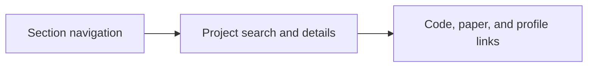

# AI Developer Portfolio

A portfolio website organizing my background, experience, projects, research, and professional profiles.

**Status:** Portfolio website  
**Tools:** TypeScript · Next.js · React · CSS

## What this project does

- Navigate between About, Experience, Projects, Research, and Contact.
- Search and filter projects and expand implementation details.
- Read publication summaries and follow paper, code, and profile links.
- Download the current CV and inspect research figures.

## How it works



Section navigation → Project search and details → Code, paper, and profile links

## Repository guide

- [`app/page.tsx`](app/page.tsx)
- [`app/globals.css`](app/globals.css)
- [`lib/portfolio-data.ts`](lib/portfolio-data.ts)
- [`lib/portfolio-details.ts`](lib/portfolio-details.ts)
- [`package.json`](package.json)

## Setup and use

Install dependencies and start the development server:

```sh
npm ci
npm run dev
```

Build the GitHub Pages export with:

```sh
NEXT_PUBLIC_BASE_PATH=/Azka-AI-Developer npm run build
```

The export is written to `out/`. The GitHub Pages workflow publishes it from the main branch.

## Current limits

Project details are maintained separately from layout code. Private repositories stay private; the portfolio identifies their visibility instead of embedding private source files.

## Related work

- [Live portfolio](https://azka1212.github.io/Azka-AI-Developer/)

## Portfolio

[Project details and related work](https://azka1212.github.io/Azka-AI-Developer/#projects)

> Documentation was checked against the repository source. Unless explicitly stated, setup commands describe the intended entry points and were not executed as part of this documentation update.
